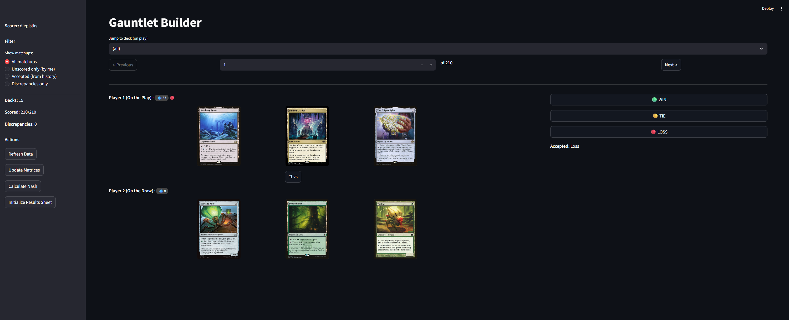

# 3CB Gauntlet Builder

A Streamlit app for scoring 3CB (Three Card Blind) deck matchups with Google Sheets integration. Multiple scorers can contribute, with automatic discrepancy detection and Nash equilibrium calculation.



## Features

- Score deck matchups with WIN/TIE/LOSS buttons
- Automatic card image display via Scryfall API
- Google Sheets integration for collaborative scoring
- Multiple scorer support with consensus tracking
- Discrepancy detection between scorers
- Nash equilibrium calculation for optimal deck selection
- Filter views: all matchups, unscored, accepted, or discrepancies

## Installation

### Prerequisites

- Python 3.10 or higher
- [uv](https://docs.astral.sh/uv/) (recommended) or pip

### Setup

1. Clone the repository:
   ```bash
   git clone https://github.com/yourusername/3cb-gauntlet-builder.git
   cd 3cb-gauntlet-builder
   ```

2. Install dependencies:
   ```bash
   # Using uv (recommended)
   uv sync

   # Or using pip
   pip install -e .
   ```

3. Set up Google Sheets API credentials (see below)

4. Run the app:
   ```bash
   # Using uv
   uv run streamlit run app.py

   # Or directly
   streamlit run app.py
   ```

## Google Sheets Setup

### 1. Create a Google Cloud Project

1. Go to the [Google Cloud Console](https://console.cloud.google.com/)
2. Create a new project
3. Enable the **Google Sheets API** and **Google Drive API**

### 2. Create Service Account Credentials

1. Go to **APIs & Services > Credentials**
2. Click **Create Credentials > Service Account**
3. Fill in the service account details
4. Click on the created service account
5. Go to **Keys > Add Key > Create new key**
6. Select **JSON** format
7. Save the downloaded file as `credentials.json` in the app directory

### 3. Create Your Google Sheet

Create a Google Sheet with the following tabs:

| Tab Name | Purpose |
|----------|---------|
| `Decks` | List deck names in column A (format: `Card1 \| Card2 \| Card3`) |
| `Results` | Auto-populated with matchup results |
| `Matrix_OnPlay` | Auto-populated win/loss matrix (on play) |
| `Matrix_OnDraw` | Auto-populated win/loss matrix (on draw) |
| `Game_Matrix` | Combined payoff matrix |
| `Nash` | Nash equilibrium weights |

### 4. Share the Sheet

Share your Google Sheet with the service account email (found in `credentials.json` under `client_email`). Give it **Editor** access.

## Usage

1. Start the app and enter your Google Sheet URL
2. Enter your name (creates a scorer column)
3. Click **Connect to Sheet**
4. Navigate through matchups and score them as WIN/TIE/LOSS
5. Use filters to focus on unscored or disputed matchups
6. Click **Calculate Nash** to compute optimal deck weights

### Sidebar Actions

- **Refresh Data**: Sync with Google Sheet and normalize deck names
- **Update Matrices**: Rebuild win/loss matrices from results
- **Calculate Nash**: Compute Nash equilibrium deck weights
- **Initialize Results Sheet**: Set up matchup grid for new decks

## Project Structure

```
3cb-gauntlet-builder/
├── app.py                  # Main Streamlit application
├── sheets_integration.py   # Google Sheets API integration
├── nash.py                 # Nash equilibrium calculation
├── pyproject.toml          # Project dependencies
├── credentials.json        # Google API credentials (not in repo)
├── data/                   # Optional data files
│   └── history.csv         # Historical matchup results
└── screenshots/            # App screenshots
```

## Scoring System

- **2 = WIN**: Deck on play wins the matchup
- **1 = TIE**: Matchup is a draw
- **0 = LOSS**: Deck on play loses the matchup

Scores are from the perspective of the deck on play.

## License

MIT License
